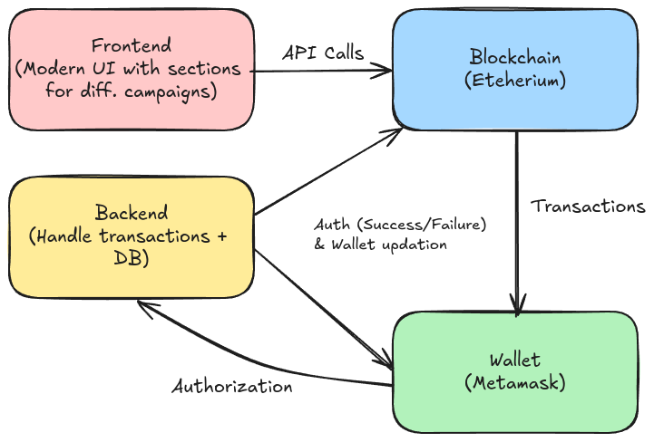
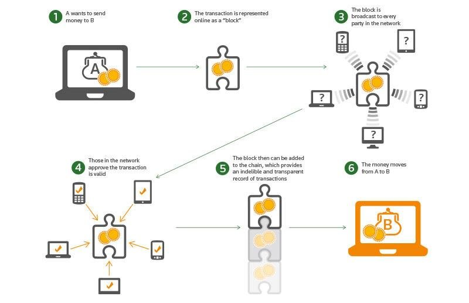
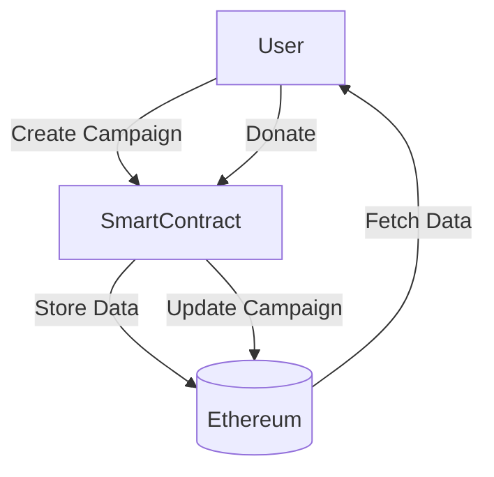

# Fund33

## Overview

Welcome to our **Web3 Crowdfunding Platform**—a decentralized application (dApp) built on the Ethereum blockchain. This platform enables users to create, view, and donate to crowdfunding campaigns securely through blockchain technology. The platform is divided into two main sections:

1. **General Crowdfunding**: For personal, community, and business funding needs.
2. **Government-Related Funds**: Dedicated to relief efforts, disaster management, and public welfare initiatives.

With a sleek and user-friendly design, our platform ensures seamless interaction with the blockchain, allowing users to pair their MetaMask wallet, interact with smart contracts, and send Ethereum donations securely.

## Features

- **Decentralized Campaign Management**: Create, view, and donate to campaigns directly through the Ethereum blockchain.
- **MetaMask Integration**: Secure wallet pairing for easy and safe transactions.
- **Smart Contracts**: Transparent and automated handling of funds using Solidity-based contracts.
- **Dual Campaign Sections**:
  - **General Crowdfunding**: Open to all for personal or business fundraising.
  - **Government Funds**: Specifically for government-related relief efforts and disaster management.
- **Real-time Updates**: Track funding progress with live data pulled from the blockchain.
- **Responsive Design**: Accessible on both desktop and mobile devices.

## Architecture Overview

### Platform Architecture

The platform architecture includes a modern frontend for user interaction, a backend that handles transactions and database operations, the Ethereum blockchain for secure and transparent transaction processing, and MetaMask for wallet management. Users interact with the frontend, which sends API calls to the backend. The backend processes these requests, communicates with the blockchain to execute smart contracts, and updates the wallet. This flow ensures secure, decentralized management of crowdfunding campaigns with real-time updates and transparency.

### Blockchain-Based Money Transfer

The process begins when a user initiates a transaction by creating a digital transaction request. This request includes the recipient's address (a unique identifier), the amount to be transferred, and a small transaction fee to incentivize network validators (miners or nodes).

The transaction is then broadcasted to the network, where it is picked up by validators who group it with other transactions into a "block." Validators verify the authenticity of the transaction by checking if the sender has sufficient funds and that the transaction complies with the blockchain's rules. Once validated, the block is added to the blockchain, making the transaction immutable and transparent to all network participants. The recipient can then access the funds in their digital wallet once the transaction is confirmed, which can take varying amounts of time depending on the blockchain's consensus mechanism and network traffic.

This decentralized process ensures that money transfers are secure, transparent, and free from the control of centralized entities like banks. Each transaction is cryptographically secured, and the blockchain's distributed nature prevents any single point of failure, enhancing the overall security of financial transfers in a blockchain system.

### Technology Stack

- **Frontend**: React.js, TailwindCSS, TypeScript
- **Blockchain**: Ethereum, Solidity
- **Wallet Integration**: MetaMask
- **Backend**: Node.js, Express
- **Smart Contracts**: Solidity

## Smart Contract Flow (Subject to Change)

## Government-Related Funds Section

This section is dedicated to government-related crowdfunding campaigns like relief funds and disaster management. It includes:

1. Verification: Only verified government entities can create campaigns in this section.
2. Transparency: Detailed reporting of fund usage and impact.
3. Urgency Handling: Priority campaigns with fast-tracked processing.

## Usage

1. Connect MetaMask:

    - Ensure MetaMask is installed and connected to the Rinkeby test network.
    - Click on "Connect Wallet" on the home page to pair your wallet.

2. Create a Campaign:

    - Navigate to the "Create Campaign" section.
    - Fill in the required details and submit.

3. Donate to a Campaign:

    - Browse through active campaigns.
    - Select a campaign and click "Donate".
    - Confirm the transaction in MetaMask.

4. View Campaigns:

    - Explore ongoing campaigns in both the general and government-related sections.
    - Track funding progress in real-time.
